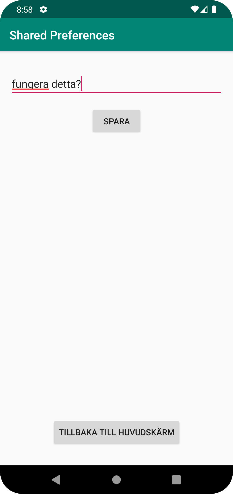
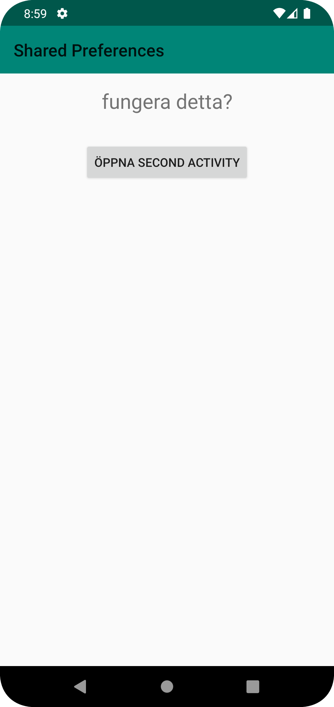

# Rapport
I mainActivity la jag till SharedPreferences i onResume. Detta gjordes för garenterna att den senaste datan sparades i SecondActivity och visas korrekt i mainActivity.
SharedPreferences användes för att uppdatera användargränssnittet med den senast informationen.
```
public void onClick(View view) {
              ...
    }

    @Override
    protected void onResume() {
        super.onResume();
        SharedPreferences sharedPreferences = getSharedPreferences("MinaInställningar", MODE_PRIVATE);
        String användarnamn = sharedPreferences.getString("Nyckel", "DefaultNamn");  // Ändra "Nyckel" till vad du faktiskt använder i SecondActivity när du sparar datan
        användarTextView.setText(användarnamn);
    }
}
```

Därefter så skapades en secondActivity och även en layout med EditText(textinmatning) och Button(spara datan)
Även i main så skapades en intent för att öppna secondActivity.
```
 protected void onCreate(Bundle savedInstanceState) {
      ..
        btnOpenSecond.setOnClickListener(new View.OnClickListener() {
            @Override
            public void onClick(View view) {
                Intent intent = new Intent(MainActivity.this, SecondActivity.class);
                startActivity(intent);
            }
        });
    }
```

I secondActivity la det in så att användaren kan mata in in text och därefter spara det i sharedPreferences.
Därefter så användes även toast för att få upp en liten notis som att sparandet har lyckas. 
```
saveButton.setOnClickListener(new View.OnClickListener() {
            @Override
            public void onClick(View view) {
                ...            
                SharedPreferences sharedPreferences = getSharedPreferences("MinaInställningar", MODE_PRIVATE);
                SharedPreferences.Editor editor = sharedPreferences.edit();
                editor.putString("Nyckel", textToSave);
                editor.apply();
                Toast.makeText(SecondActivity.this, "Sparat i inställningar", Toast.LENGTH_SHORT).show();
            }
        });
```
 I slutet så skulle den uppdaterade texten visas mainActivity skulle ha den texten när secondActivity var stängd. Detta gjordes med hjälp av uppdatteringen i onResum. 
Därefter la jag själv till en knapp i secondActivity för att återgå till mainActivity för jag själv tyckte det var jobbigt att hitta tillbaka knapp.
Detta gjordes med hjälp av en button i onClick i secondActivity och med hjälp av finish().
```
 public void onClick(View view) {
                String textToSave = editText.getText().toString();
                ...
            }
        });
...
            @Override
            public void onClick(View view) {
                finish();
            }
```


